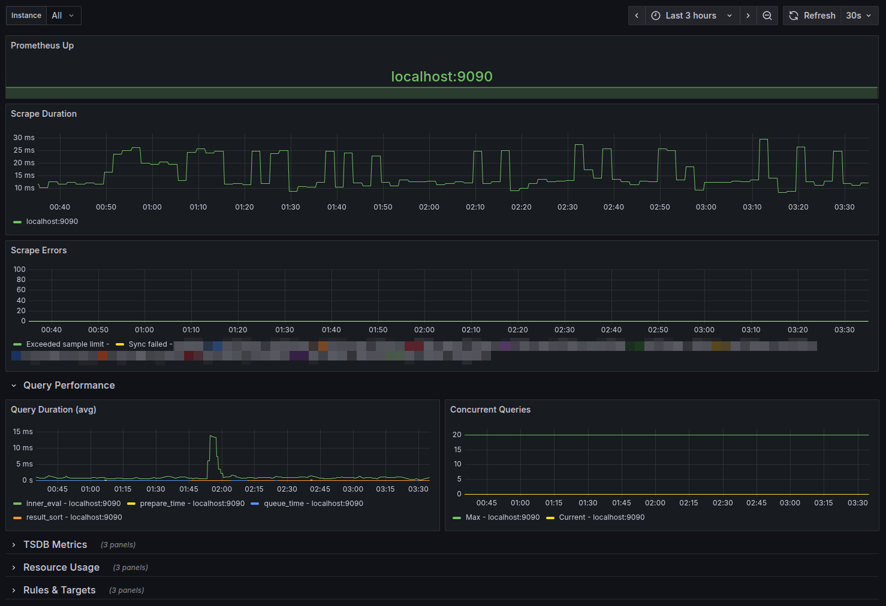

# Grafana Dashboard for Prometheus Monitoring

A comprehensive Grafana dashboard designed to monitor Prometheus itself, providing visibility into Prometheus performance, resource usage, and operational metrics.

## Overview

This dashboard helps you monitor the health and performance of your Prometheus instance(s), including:

- **Uptime Status**: Track Prometheus availability with color-coded instance status
- **Query Performance**: Monitor query duration and concurrent queries
- **Scrape Metrics**: Track scrape duration and scrape errors
- **TSDB Metrics**: View time-series database head series, chunks, and health
- **Resource Usage**: Monitor memory consumption, CPU time, and goroutines
- **Rule Evaluation**: Track rule evaluation duration and failures
- **Active Targets**: Keep track of active scrape targets

### Features

- **Instance Filtering**: Filter metrics by specific Prometheus instance or view all instances together
- **Multi-Instance Support**: Display status for multiple Prometheus instances with color-coded indicators
- **Organized Layout**: Collapsible sections for TSDB Metrics, Resource Usage, and Rules & Targets
- **Real-time Updates**: 30-second refresh interval
- **3-Hour Default Time Range**: Configurable time window for historical data

## Panels Included

### Status & Scraping
1. **Prometheus Up** - Color-coded status showing instance names (green=up, red=down)
2. **Scrape Duration** - Tracks how long scrapes take in milliseconds
3. **Scrape Errors** - Monitors exceeded sample limits and sync failures

### Query Performance
4. **Query Duration (avg)** - Average query execution time
5. **Concurrent Queries** - Current and maximum concurrent queries

### TSDB Metrics (Collapsed)
6. **TSDB: Head Series** - Time-series database head series count
7. **TSDB: Chunks** - Number of chunks in the TSDB
8. **TSDB: Health & Failures** - Compaction, reload, truncation failures, and WAL corruptions

### Resource Usage (Collapsed)
9. **Prometheus Memory Usage** - Memory consumption (RSS)
10. **Prometheus CPU Time** - CPU usage tracking
11. **Goroutines** - Number of active goroutines

### Rules & Targets (Collapsed)
12. **Rule Evaluation Duration** - Average time taken to evaluate rules
13. **Rule Evaluation Failures** - Rate of rule evaluation failures
14. **Prometheus Active Targets** - Table showing discovered targets by job and config

## Installation

1. Log into your Grafana instance
2. Navigate to **Dashboards** → **Import**
3. Upload the `grafana-dashboard.json` file or paste its contents
4. Select your Prometheus datasource
5. Click **Import**

## Requirements

- Grafana 7.0 or higher
- A configured Prometheus datasource in Grafana
- Prometheus server exposing its own metrics (default endpoint: `/metrics`)

## Configuration

Ensure your Prometheus instance is configured to scrape its own metrics by adding this to your `prometheus.yml`:

```yaml
scrape_configs:
  - job_name: 'prometheus'
    static_configs:
      - targets: ['localhost:9090']
```

## Usage

Once imported, the dashboard provides real-time monitoring of your Prometheus instance. Use it to:

- **Filter by instance**: Use the dropdown at the top to select a specific Prometheus instance or view "All" instances
- Detect performance issues or degradation
- Monitor resource consumption trends
- Identify scraping problems
- Track TSDB growth and efficiency
- Ensure rule evaluation is performant

The instance selector allows you to monitor multiple Prometheus instances from a single dashboard, making it ideal for federated or highly available Prometheus setups.

## License

See [LICENSE](LICENSE) file for details.

